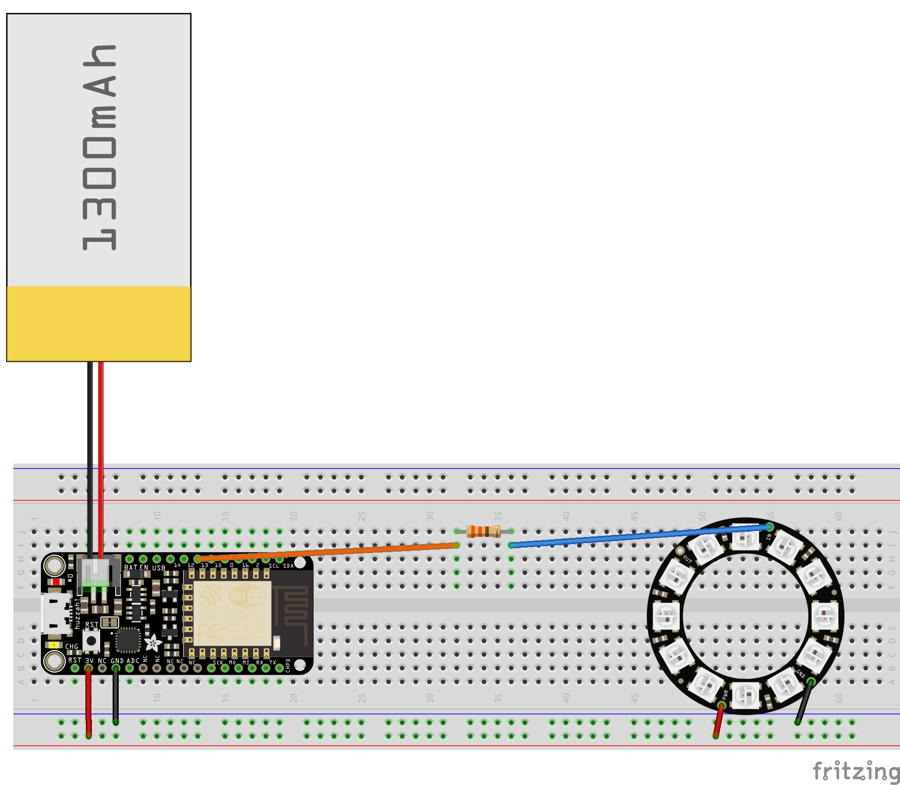

*Note this solution doesn't handle rapid requests in it's current state. Allow at least 30 seconds between calls. See the [HTTP solution](https://github.com/kottofy/IlluminateMe) for rapid requests. 

*Updated for version 1.0.36 Azure IoT Hub C SDK

# IlluminateMe MQTT

This application enables the [Adafruit Feather Huzzah](https://www.adafruit.com/products/2821)
or any ESP8266 chip to receive messages from an IoT-Hub that will light up a 
[Neopixel ring](https://www.adafruit.com/products/1643)
or [jewel](https://www.adafruit.com/products/2226) when a tweet is made.


# Tech Overview
This project uses a [Logic App](https://azure.microsoft.com/en-us/services/logic-apps/) to watch 
for a new tweet based on dynamic search terms. Upon triggering, a message containing the tweet 
content is sent to a [Function app](https://azure.microsoft.com/en-us/services/functions/) 
function which then send a messageto the device through an [IoT Hub](https://azure.microsoft.com/en-us/services/iot-hub/). 
The device will then send a reply back to the IoT Hub to, usually
to inform the resource that the message was received and can be removed from the queue.

The great thing about using a Logic App is that is has so many different connectors. So, if desired, 
the Logic App can be triggered when a new Facebook post occurs, when a new OneDrive document is 
uploaded, when a Wunderlist task reminder occurs, on a reoccuring timer, or when one of the many
other options for triggers happens.


## Required Software
1. Install [Arduino](https://www.arduino.cc/en/Main/Software).
2. Install [Device Explorer](https://github.com/Azure/azure-iot-sdks/releases) (Select SetupDeviceExplorer.msi under Downloads).

## Required Hardware


1. [Adafruit Feather Huzzah](https://www.adafruit.com/products/2821) or other ESP8266 chip with wifi
2. [Neopixel ring](https://www.adafruit.com/products/1643) or [jewel](https://www.adafruit.com/products/2226)
3. Micro USB cable to USB cable
4. [Battery](https://www.adafruit.com/products/1578)
5. There are two options.
    - Option 1: If you are good at soldering: some soldering wire and hookup wire.
    - Option 2: If you would rather not solder: breadboard and breadboard wiring. (Warning, 
    you may need to fidget with the pins to keep them touching the ports on the board.)

# Steps
1. Create Azure IoT Hub.
2. Setup with Device Explorer.
3. Create Azure Functions App.
4. Create Logic App.
5. Setup Device.
6. Deploy Code

# Create Azure IoT Hub

1. Sign in to the [Azure portal](https://portal.azure.com/).

2. In the Jumpbar, click New > Internet of Things > IoT Hub.

    

3. In the IoT hub blade, choose the configuration for your IoT hub.

    

    - In the Name box, enter a name for your IoT hub. If the Name is valid and available, a green check mark appears in the Name box.
    - Select a pricing and scale tier. This tutorial does not require a specific tier. For this tutorial, use the free F1 tier.
    - In Resource group, either create a resource group, or select an existing one. For more information, see Using resource groups to manage your Azure resources.
    - In Location, select the location to host your IoT hub. For this tutorial, choose your nearest location.

4. When you have chosen your IoT hub configuration options, click Create. It can take a few minutes for Azure to create your IoT hub. To check the status, you can monitor the progress on the Startboard or in the Notifications panel.

    

5. When the IoT hub has been created successfully, click the new tile for your IoT hub in the Azure portal to open the blade for the new IoT hub. Make a note of the Hostname, and then click Shared access policies.

    

6. In the Shared access policies blade, click the iothubowner policy, and then **copy and make note of the IoT Hub connection string** in the iothubowner blade.

    


# Setup with Device Explorer

## Create Device with Device Explorer

1. Open Device Explorer. 

2. Paste in the copied iothubowner policy from the previous step in the IoT Hub Connection String box. 

    

3. Click update and you should receive a success message. Click OK to dismiss the message. 

    

4. Click the Management tab and click the Create button under the Actions menu.

    

5. Enter a Device name in the Device Id box and click the Create button when finished.

    


## Obtain Connection String from Device Explorer

1. In Device Explorer, open the Management tab, select the device, right-click, and choose "Copy connection string for selected device". Save this connection string for later. 

    

# Create Azure Functions App

1. On the Azure portal dashboard, select New. 
2. In the search bar, search for 'Function App', and then select Function App.
3. Enter a name for your logic app, select a location, resource group, and select Create. If you select Pin to Dashboard the logic app will automatically open once deployed. 

    


# Create Logic App

1. On the Azure portal dashboard, select New. 

2. In the search bar, search for 'logic app', and then select Logic App. You can also select New, Web + Mobile, and select Logic App. 

    

3. Enter a name for your logic app, select a location, resource group, and select Create. If you select Pin to Dashboard the logic app will automatically open once deployed. 

    

4. After opening your logic app for the first time you can select from a template to start. For now click Blank Logic App to build this from scratch. 

    

5. The first item you need to create is the trigger. This is the event that will start your logic app. Search for twitter in the trigger search box, and select "When a new tweet is posted".

    . You may need to create a new connection and grant Azure permission to access your account.

6. Now you'll type in a search term to trigger on. The Frequency and Interval will determine how often your logic app will check for new tweets (and return all tweets during that time span). 

    

7. Select the New step button, and then choose Add an action.

    

8. Select the Azure Functions action from the options if available. Otherwise, search for it and select it.

    

9. Select "Azure Functions - Choose an Azure function".

    

10. Select the Azure Function App you created in the previous section.

    

11. Select "Azure Functions-Create New Function" option.

    

12. Update the input payload object box with `{"tweetText":"<Tweet text dynamic content>"}`, replacing `<Tweet text dynamic content>` with the Tweet text option on the dynamic content menu. Click Next.

    

13. Provide your function with a name and click Create.

    

14. Save your Logic App! Your logic app will run immediately after saving.

    


## Update Function App

1. Open the Function App created in the Function App section and open the Function created in the Logic App section.

    

2. Copy the following code and paste it into your function.

    ````JavaScript
    'use strict';

    var Client = require('azure-iothub').Client;
    var Message = require('azure-iot-common').Message;
    
    var connectionString = 'your-iot-hub-connection-string';
    var targetDevice = 'your-device-name';
    var client = Client.fromConnectionString(connectionString);
    var console, context;
    var open = false;

    module.exports = function(cntxt, data) {
        console = cntxt;
        context = cntxt;

        if (open) {
                var message = new Message(data.message);
                message.ack = 'full';          
                console.log('Sending message: ' + message.getData());
                client.send(targetDevice, message, printResultFor('send'));
            }
        else
            checkClientOpen(open);

        console.done();
    };  

    function checkClientOpen(checkMe) {
        if (checkMe)
            return;  
        else
            openClient(); 
    }

    function openClient() {
        client.open(function (err) {
            if (err) {
                console.error('Could not connect: ' + err.message);
                open = false;
            } else {
                console.log('Client connected');
                //client.getFeedbackReceiver(receiveFeedback);
                open = true;    
            }
        });
    }

    function printResultFor(op) {
        return function printResult(err, res) {
            if (err) context.log(op + ' error: ' + err.toString());
            if (res) context.log(op + ' status: ' + res.constructor.name);
        };
    }

    function receiveFeedback(err, receiver){
        receiver.on('message', function (msg) {
            context.log('Feedback message:')
            context.log(msg.getData().toString('utf-8'));
        });
    }
    ````
3. Update the `connectionString` and `targetDevice` with your information.

4. At the bottom left, click "Function app settings".

    

5. Select "Go to App Service Settings".

    

6. Scroll down in the menu and select Console to open it.

    

7. Type `npm install azure-iothub` and hit enter to run the command. Be patient. This may take a while or it may fail. If you have issues with node_modules in the future, retry this step.

    

8. Type `npm install azure-iot-common` and hit enter to run the command. Be patient. This may take a while or it may fail. If you have issues with node_modules in the future, retry this step.

    

10. Return to the Function app. You can view the messages your function app is displaying by selecting the Logs button.

    


# Setup Device

1. There are two options to device setup. 

    - Option 1: If you are not soldering your parts or want to test first,
    connect your parts as in the following diagram.

    

    - Option 2: If you are done testing and ready to solder, connect your parts
    as shown below.

    


# Deploy Code to Device

1. Open the Arduino IDE and go to File -> Preferences.

2. Go to the field titled "Additional Boards Manager URLs:" and type 
`http://arduino.esp8266.com/stable/package_esp8266com_index.json`.

    

3. Click on Tools -> Board -> Boards Manager.

4. Search for esp8266, left click on the result titled `esp8266 by ESP8266 
Community` and click on install. Close the window.

    

5. After the board is installed select Tools -> Board -> Adafruit HUZZAH ESP8266.

6. Click on the Sketch -> Include Library -> Manage Libraries. Search for and install
the following libraries.

    - Adafruit NeoPixel
    - AzureIoTHub
    - AzureIoTProtocol_MQTT
    - AzureIoTUtility
    - ArduinoJSON

    

7. Download this entire repo as a ZIP. Open the file "illuminate_me.ino" in Arduino. This should open all files in that folder automatically. 

8. Navigate to the "config.h" file. Find where the code says the following and update the `WIFI_SSID`, `WIFI_PASS`, and `CONNECTION_STRING` variables.
    ````json
    ///********************** UPDATE THESE **********************///
    #define WIFI_SSID           "YourSSID"      // your network SSID (name)
    #define WIFI_PASS           "YourPassword"  // your network password (use for WPA, or use as key for WEP)
    #define CONNECTION_STRING   "YourDeviceConnectionString"    //your device connection string
    ///*********************************************************///
    ```

9. Click the arrow on the top of the Arduino IDE to Upload the code to the board.

# Assembling the Device
1. You can solder the device to take it with you! Or even 3d print a box to hold the gear!
    
2. Or you can leave it as is!
    